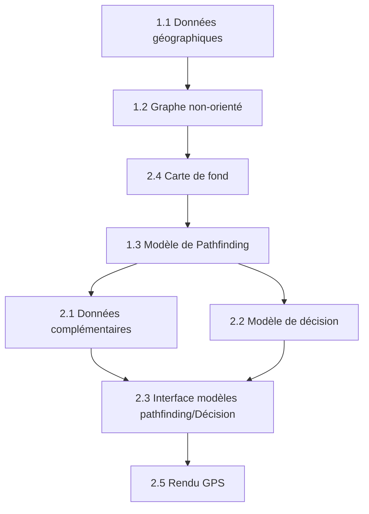

# Run_Path_Generator
Projet visant à créer un générateur d'itinéraire pour la course à pied.

## Feuille de route :

* Définition des objectifs globaux et par palier.

* Organisation et découpage du travail selon les objectifs.

* Mise en place d'un suivi d'avancement.

* Réalisation

### Objectifs globaux
Le principe est de faire un générateur d'itinéraire pour la course à pied.

Pour répondre à ce besoin on va définir les différentes fonctionnalités primaires.

**Fonctionnalités PRIMAIRES (rang 0)**
1. Pour la **partie itinéraire** il nous faut :
   1.1 des données géographiques
   1.2 une architechture type graphe non-orienté
   1.3 un modèle de pathfinding pour parcourir le graphe.

2. Pour la **partie génération (d'un itinéraire)** il nous faut :
   1. Des données complémentaires de valorisation (data qui donne un poid à la prise de décision)
   2. Un modèle de décision (Machine learning, deep learning, ... ?)
   3. Une interface modèle_décisionnaire/modèle_de_pathfinding
   4. Un support visuel pour le rendu (carte de fond avec superposition du résultat)
   5. Un support gps pour le rendu (itinéraire exportable)
  
On va ensuite priorisé ces fonctionnalités selon l'ordre d'assemblage.

